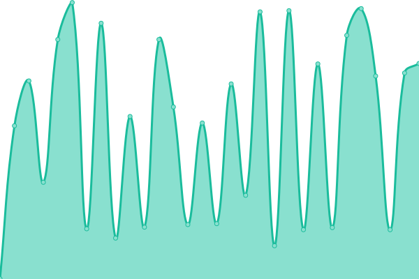

# [📈 Live Status](https://im-parsa.github.io/status): <!--live status--> **🟥 Complete outage**

This repository contains the open-source uptime monitor and status page for [im-parsa](https://im-parsa.tech), powered by [Upptime](https://github.com/upptime/upptime).

With [Upptime](https://upptime.js.org), you can get your own unlimited and free uptime monitor and status page, powered entirely by a GitHub repository. We use [Issues](https://github.com/im-parsa/status/issues) as incident reports, [Actions](https://github.com/im-parsa/status/actions) as uptime monitors, and [Pages](https://im-parsa.github.io/status) for the status page.

<!--start: status pages-->
<!-- This summary is generated by Upptime (https://github.com/upptime/upptime) -->
<!-- Do not edit this manually, your changes will be overwritten -->
<!-- prettier-ignore -->
| URL | Status | History | Response Time | Uptime |
| --- | ------ | ------- | ------------- | ------ |
|  [Portfolio](https://parsa-firoozi.ir) | 🟥 Down | [portfolio.yml](https://github.com/im-parsa/status/commits/HEAD/history/portfolio.yml) | 

 751ms
     
 | 

<a href="https://im-parsa.github.io/status/history/portfolio">98.12%</a>
    

|  [Paraffin Tutorials](https://paraffin-tutorials.ir) | 🟥 Down | [paraffin-tutorials.yml](https://github.com/im-parsa/status/commits/HEAD/history/paraffin-tutorials.yml) | 

 643ms
     
 | 

<a href="https://im-parsa.github.io/status/history/paraffin-tutorials">98.12%</a>
    

|  [Discords City](https://discords.city) | 🟥 Down | [discords-city.yml](https://github.com/im-parsa/status/commits/HEAD/history/discords-city.yml) | 

 373ms
     
 | 

<a href="https://im-parsa.github.io/status/history/discords-city">88.35%</a>
    

<!--end: status pages-->

[**Visit our status website →**](https://im-parsa.github.io/status)

## 📄 License

- Powered by: [Upptime](https://github.com/upptime/upptime)
- Code: [MIT](./LICENSE) © [im-parsa](https://im-parsa.tech)
- Data in the `./history` directory: [Open Database License](https://opendatacommons.org/licenses/odbl/1-0/)
